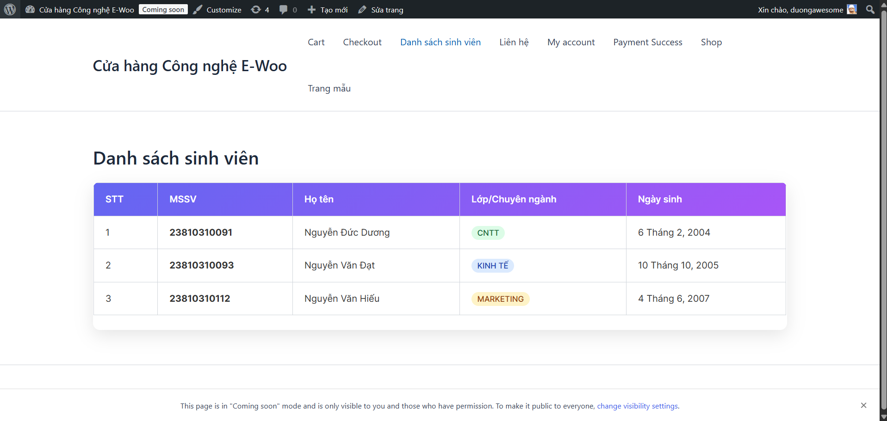

# Student Manager Plugin

**Sinh viên thực hiện:** Nguyễn Đức Dương  
**MSSV:** 23810310091

Plugin quản lý sinh viên chuyên nghiệp dành cho WordPress.

## 🌟 Chức năng chính

### A. Quản trị hệ thống (Backend)
- **Custom Post Type**: Đăng ký mục "Sinh viên" trong menu WordPress với đầy đủ các thuộc tính (Họ tên, Tiểu sử).
- **Custom Meta Boxes**: Khu vực nhập liệu bổ sung chuyên sâu:
  - **MSSV**: Mã số sinh viên.
  - **Lớp/Chuyên ngành**: Lựa chọn từ danh sách (CNTT, Kinh tế, Marketing).
  - **Ngày sinh**: Chọn ngày từ lịch (Date picker).
- **Bảo mật**: Xử lý dữ liệu an toàn với Nonce và Sanitization.

### B. Hiển thị dữ liệu (Frontend)
- **Shortcode**: Sử dụng `[danh_sach_sinh_vien]` để hiển thị danh sách sinh viên.
- **Giao diện**: Hiển thị dạng bảng (HTML Table) cao cấp, hỗ trợ responsive và thiết kế hiện đại.

## 📂 Cấu trúc thư mục
```text
student-manager/
├── student-manager.php     # File chính plugin
├── includes/               # Xử lý logic
│   ├── cpt-student.php     # Đăng ký Custom Post Type
│   ├── meta-box.php        # Xử lý Meta Box
│   └── shortcode.php       # Xử lý Shortcode hiển thị
├── assets/                 # Tài nguyên
│   └── style.css           # CSS cho giao diện
└── README.md               # Hướng dẫn sử dụng
```

## 📸 Kết quả thực hiện


*(Giao diện danh sách sinh viên với phong cách hiện đại, hỗ trợ phân loại chuyên ngành bằng màu sắc)*

## 🚀 Hướng dẫn cài đặt
1. Tải thư mục `student-manager` lên thư mục `wp-content/plugins/`.
2. Kích hoạt plugin trong trang Quản trị WordPress.
3. Thêm sinh viên mới tại mục **Sinh viên > Thêm mới**.
4. Chèn shortcode `[danh_sach_sinh_vien]` vào bất kỳ trang (Page) hoặc bài viết (Post) nào để hiển thị danh sách.
